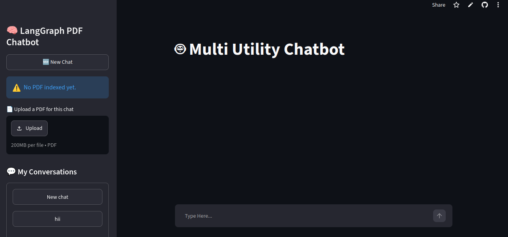
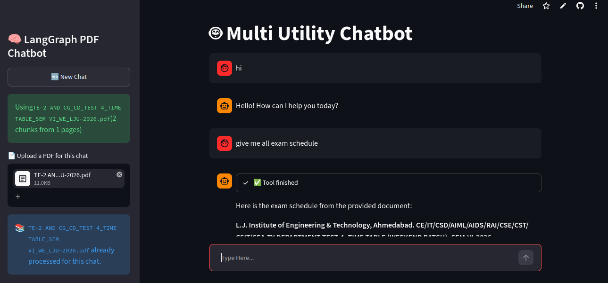
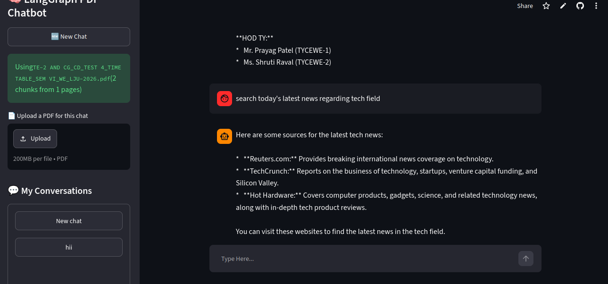

# 🤖 Multi-Utility AI Chatbot

An AI-powered multi-utility chatbot built using **LangGraph**, **LangChain**, and **Streamlit**. It supports conversational AI, PDF question answering, web search, stock information, and basic calculations through integrated tools.

## 🚀 Live Demo

**Streamlit App**

https://multi-utility-chatbot-en6dreybuijrmtqreeo8tg.streamlit.app/

---

## ✨ Features

- 💬 Multi-turn conversational chatbot
- 📄 Upload PDF and ask questions (RAG)
- 🌐 Web Search using DuckDuckGo
- 📈 Real-time Stock Information (Alpha Vantage API)
- 🧮 Calculator Tool
- 🔄 Automatic fallback from Gemini to Groq when quota is exceeded
- 🧠 Persistent conversation history using LangGraph + SQLite
- 📚 Multiple chat sessions
- ⚡ Built with Streamlit

---

## 🛠️ Tech Stack

### Frontend
- Streamlit

### Backend
- Python
- LangGraph
- LangChain

### AI Models
- Google Gemini 2.5 Flash
- Groq Llama 3.3 70B

### Vector Database
- FAISS

### Embeddings
- HuggingFace Sentence Transformers
- all-MiniLM-L6-v2

### Tools
- DuckDuckGo Search
- Alpha Vantage API
- Calculator
- PDF Retrieval (RAG)

---

## 📂 Project Structure

```
├── streamlit_frontend.py
├── langgraph_backend.py
├── requirements.txt
├── chatbot.db
└── README.md
```

---

## ⚙️ Installation

Clone the repository

```bash
git clone https://github.com/<your-username>/<repository-name>.git
```

Move into the project

```bash
cd <repository-name>
```

Create virtual environment

```bash
python -m venv .venv
```

Activate

Windows

```bash
.venv\Scripts\activate
```

Linux/Mac

```bash
source .venv/bin/activate
```

Install dependencies

```bash
pip install -r requirements.txt
```

---

## 🔑 Environment Variables

Create a `.env` file in the project root.

```env
GEMINI_API_KEY=YOUR_GEMINI_KEY
GROK_API_KEY=YOUR_GROQ_KEY
ALPHA_VANTAGE_API_KEY=YOUR_ALPHA_VANTAGE_KEY

LANGCHAIN_TRACING_V2=true
LANGCHAIN_ENDPOINT=https://api.smith.langchain.com
LANGCHAIN_API_KEY=YOUR_LANGSMITH_KEY
LANGCHAIN_PROJECT=Chatbot-Project
```

---

## ▶️ Run

```bash
streamlit run streamlit_frontend.py
```

---

## 💡 Supported Capabilities

- Chat with AI
- Upload PDF and ask questions
- Internet search
- Stock market lookup
- Mathematical calculations
- Multiple conversation history
- Persistent memory

---

## 📸 Screenshots

<h2>📸 Screenshots</h2>

<h3>Home Page</h3>


<h3>PDF Chat</h3>


<h3>Web Search</h3>


---

## 📦 Deployment

This project is deployed on **Streamlit Community Cloud**.

Live Demo:

https://multi-utility-chatbot-en6dreybuijrmtqreeo8tg.streamlit.app/

---

## 👨‍💻 Author

**Mahek Rana**

Computer Science & Technology Student

AI | Machine Learning | Full Stack Development

---

## ⭐ If you like this project

Please consider giving the repository a ⭐ on GitHub.
